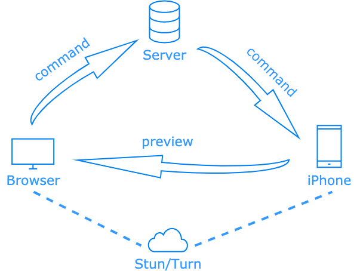
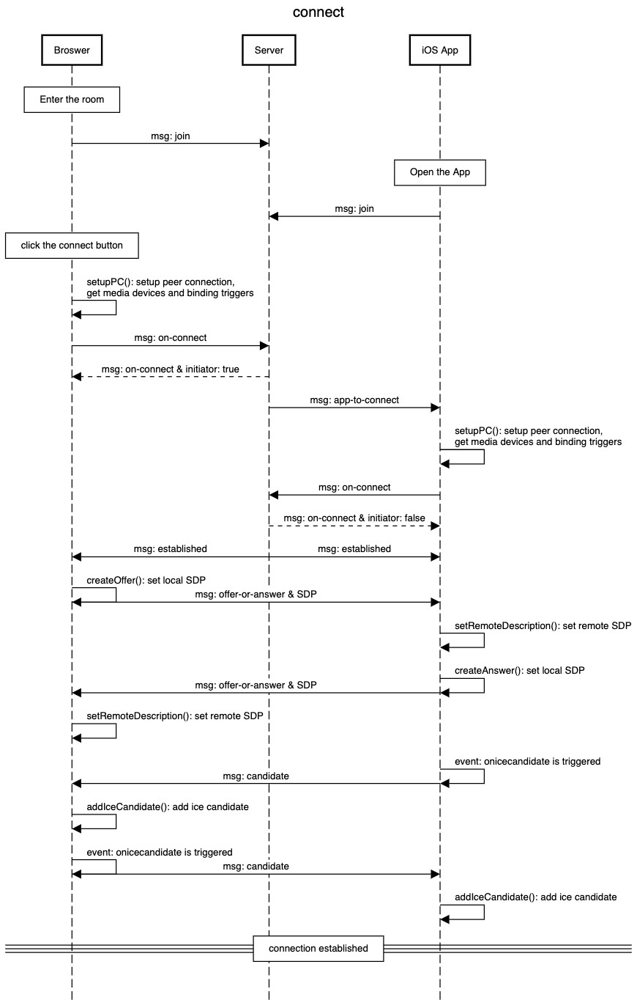

# ip-cam

## 1. Goal

Ip-cam is designed to help experiments in Northwestern University’s [Computational Photogra](http://compphotolab.northwestern.edu/)phy Lab. It is an image capture system with real-time preview and camera settings. The basic idea of this project is to use a website to operate the camera of an iPhone or iPad, including preview streaming, photo-taking, and camera setting. 

## 2. Code

Web client and server repo: [ip-cam(branch: dev)](https://github.com/jiangbryn/ip-cam/tree/dev)

IOS app repo: [camAppTest](https://github.com/jiangbryn/camAppTest)

## 3. Instruction

### 3.1 Setup

3.1.1 Preinstall: Nodejs, yarn, parcel-bundler

3.1.2 Server:

1. `cd ./server`
2. `npm install`

3.1.3 Web Client:

1. Change [this address](https://github.com/jiangbryn/ip-cam/blob/master/client/components/MainPage.js#L38) to your IP
2. `cd ./client`
3. `yarn build`

3.1.3 IOS App:

1. Setup Xcode (an iPhone is needed. Cannot run on a simulator)
2. `npm install`
3. `cd ./ios pod install`
4. Change [this address](https://github.com/jiangbryn/camAppTest/blob/master/App.js#L27) to your IP
5. If you want to transplant the camAppTest to your react native project, follow the steps in this [instruction](https://github.com/react-native-webrtc/react-native-webrtc/blob/master/Documentation/iOSInstallation.md) to install webrtc-react-native (Ignore, if you will develop over the camAppTest)

### 3.2 To Use

3.2.1 Server:

1. `cd ./server`
2. `node index.js`

3.2.2 Web Client:

1. `cd ./client`
2. `yarn start`
3. The URL [http://localhost:1234/](http://localhost:1234/), it will direct the user to the room ID entering page. Or enter the URL ‘[http://localhost:1234/#/roomid](http://localhost:1234/#/roomid)’ to direct the user to the main page of the room with that ID.
4. Make sure the app has opened, then click the connect button on the main page
5. To take a still photo, click the disconnect button to pause preview streaming first, then click the take photo button.
6. To set the camera, click to save button after finishing all the settings

3.2.3 IOS App:

1. Open the app before clicking the connect button on the website.

## 4. Design

The system contains three parts, a server, a web browser client, and an ios client. The server provides a communication service. If the website and ios app enter the same socket room, a WebSocket is established on the server. Then, the camera on the device can start streaming video to the website. The website offers some settings such as exposure time, flash, and a choice of front camera and back camera. After the settings are saved, they will be sent to the ios app. The ios app will set up the camera after receiving these settings. 

The structure of the system is shown in the following figure.

### 4.1 Server

The server is developed based on Express.js. Express is a minimal and flexible Node.js web application framework that provides a robust set of features for web and mobile applications. Since the server has a single responsibility and does not have high-performance requirements, it is more convenient to use Express for development. 

The main responsibility of the server is to provide communication services. For this, Socket.IO is used here. Socket.IO is a library that enables real-time, bidirectional, and event-based communication between the browser and the server. In Socket.IO, all communications are based on the concept of the room, which is very suitable for our project. Socket objects can send messages to anyone in the same room and all the room are independent. Using that we can run multiple services for different purposes. We can also easily extend our system to provide functions like a web page to control multiple devices or multiple web pages to monitor one device.

The server listens to some important messages, like `join`, `candidate` and `offerOrAnswer`. The following table describes the socket message the server monitor and the operation it will do.

<table>
  <tr>
   <td><strong>Socket Message</strong>
   </td>
   <td><strong>Operation</strong>
   </td>
  </tr>
  <tr>
   <td>join
   </td>
   <td>Check the number of sockets in the room and emit the corresponding message to the front-end
   </td>
  </tr>
  <tr>
   <td>offerOrAnswer
   </td>
   <td>Log the SDP data and emit the data to the others in that room
   </td>
  </tr>
  <tr>
   <td>candidate
   </td>
   <td>Log the ICE candidate data and emit the data to the others in that room
   </td>
  </tr>
  <tr>
   <td>setting
   </td>
   <td>Log the camera settings and emit the settings to the ios app
   </td>
  </tr>
  <tr>
   <td>disconnect
   </td>
   <td>Log the disconnect message and emit that message to others in the room.
   </td>
  </tr>
</table>

### 4.2 Client - Web

The front-end is developed based on React. The entry file of the front-end is `index.js`. It contains a router that can route users to a room ID entering page or the main page. In the `MainPage.js` the socket is connected and be passed to the children component of `MainPage`. `VideoPreview` is a wrapper component of `Video`, and `Video` is the core component in this project. `Setting` is the component deal with the camera setting. 

`Video` is the component to handle the video streaming by using WebRTC. [WebRTC](https://developer.mozilla.org/en-US/docs/Web/API/WebRTC_API) An open framework for the web that enables Real-Time Communications (RTC) capabilities in the browser. [Peer connections](https://webrtc.org/getting-started/peer-connections) are the part of the WebRTC specifications that deal with connecting two applications on different computers to communicate using a peer-to-peer protocol. A short WebRTC introduction and example are linked [here](https://www.html5rocks.com/en/tutorials/webrtc/basics/). The following diagrams describe how the WebRTC connection works in the ip-cam project. 

`Setting` is a component used to set the iPhone camera. Two kinds of setting components are developed `SettingSlider` and `SettingSwitch`. If new settings are needed those steps are required. 

1. Add settings to the state of the `Setting` component
2. Create handle components, like `SettingSlider` and `SettingSwitch`
3. Add the handle components to the container in `Setting.js`
4. Set state function needs to be created in `Setting.js` and pass into handle components as a property.
5. Add the states to the `handleSave()`, which is used to send the settings to the ios application.

### 4.3 Client - IOS

The IOS app is developed based on React Native. The entry file of the app is `App.js`. A socket is created in `App.js` and be passed to the core component `Video`. The `Video` component is similar to the `Video` component in the web client. It contains three properties, `roomId`, `isFront`, and `socket`. `roomId` is the ID of the room entered by the user. `isFront` is the property that controls which camera is used. Unlike the web client, there are no buttons in the application. After opening the app, the socket will automatically connect to the server and initiate peer connection.

